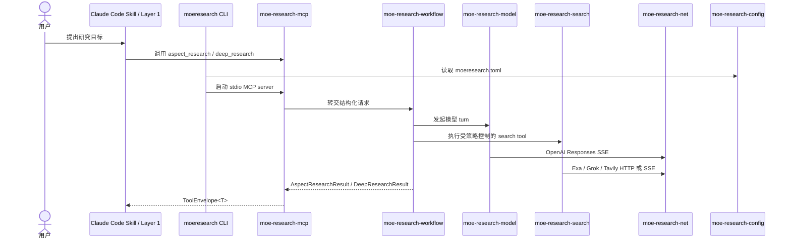
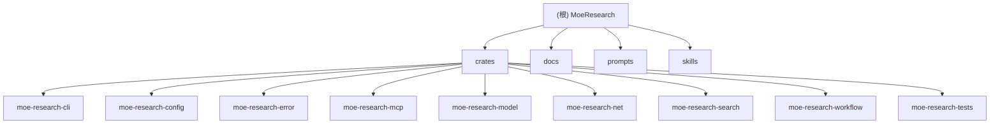

# MoeResearch / Lapis 架构文档

## 项目愿景

MoeResearch 是一个 Rust 构建的深度研究 MCP 核心服务。它不是通用聊天机器人，也不提供 Web UI；其目标是在 Claude Code Skill 或其他 MCP 客户端中作为本地、可配置、结构化的研究后端：负责 MCP stdio 服务、模型 provider 调用、搜索 provider 调用、多方面 agent 编排、预算控制、证据归因与公共安全响应封装。

## 架构总览



核心分层：

- `moe-research-cli` 是二进制入口和 composition root，负责命令行、配置生成、检查、Claude Code MCP 注册和服务启动。
- `moe-research-config` 只负责 TOML DTO、配置加载、结构验证和启用 provider 的环境变量检查。
- `moe-research-mcp` 是 MCP 适配层，暴露 `aspect_research` 与 `deep_research` 两个工具，并统一返回 `ToolEnvelope<T>`。
- `moe-research-workflow` 是研究编排核心，负责请求 schema、policy、budget、agent loop、输出验证和多 aspect 汇总。
- `moe-research-model` 抽象模型 provider，目前包含 OpenAI Responses API SSE 适配器。
- `moe-research-search` 抽象搜索 provider，目前包含 Exa、Grok、Tavily。
- `moe-research-net` 是统一网络出口，负责 JSON/SSE 请求、重试、超时、wire trace 与敏感信息脱敏。
- `moe-research-error` 提供跨 crate 的 transport-neutral 错误码和公共安全错误消息。
- `moe-research-tests` 集中承载 workspace 集成与回归测试。

## 模块结构图



## 模块索引

| 模块 | 职责 | 入口与关键文件 | 测试线索 |
| --- | --- | --- | --- |
| `crates/moe-research-cli` | CLI 二进制、配置初始化、健康检查、MCP 注册、服务启动 | `src/main.rs`, `src/commands/*`, `src/onboarding/*` | `cli_onboarding_tests.rs`, `mcp_tests.rs` |
| `crates/moe-research-config` | TOML 配置加载、provider/env 校验、配置 limit 编码 | `src/lib.rs`, `src/types.rs`, `src/loader.rs`, `src/limit.rs` | `config_tests.rs` |
| `crates/moe-research-error` | 统一错误类型、错误码、retryable 与公共安全消息 | `src/lib.rs` | 被所有集成测试间接覆盖 |
| `crates/moe-research-mcp` | MCP server、工具路由、响应 envelope | `src/server.rs`, `src/tools.rs`, `src/envelope.rs` | `mcp_tests.rs`, `schema_tests.rs` |
| `crates/moe-research-model` | 模型 provider 抽象与 OpenAI Responses SSE 适配 | `src/provider.rs`, `src/service.rs`, `src/openai.rs`, `src/types.rs` | `model_tests.rs` |
| `crates/moe-research-net` | 统一网络客户端、JSON/SSE、重试、超时、脱敏与 wire trace | `src/client.rs`, `src/reqwest_client.rs`, `src/log_safe.rs` | `network_policy_tests.rs`, `wire_trace_tests.rs` |
| `crates/moe-research-search` | 搜索 provider 抽象与 Exa/Grok/Tavily 适配 | `src/provider.rs`, `src/service.rs`, `src/provider/*` | `search_tests.rs` |
| `crates/moe-research-workflow` | 研究请求/报告 schema、agent loop、policy、budget、validator、deep research 编排 | `src/workflow.rs`, `src/agent_loop.rs`, `src/research.rs`, `src/report.rs` | `deep_research_tests.rs`, `orchestrator_tests.rs`, `policy_validator_tests.rs` |
| `crates/moe-research-tests` | 集成测试 crate 与 mock support | `tests/*.rs`, `tests/support/*` | `cargo test -p moe-research-tests` |
| `docs` | 用户、配置、MCP 与开发说明 | `docs/*.md` | 文档同步检查依赖人工 review |
| `prompts` | Layer 1 / Layer 2 prompt 资产 | `prompts/layer1/*`, `prompts/layer2/*` | 由 skill 工作流和 schema 测试间接约束 |
| `skills` | Claude Code Skill 入口示例 | `skills/deep-research.md`, `skills/pm-deep-research.md` | 由 PM DeepResearch 文档约束 |

## 运行与开发

常用命令：

```bash
cargo build
cargo build --release
cargo run -- init --config moeresearch.toml --non-interactive --enable-openai --force
cargo run -- check --config moeresearch.toml
cargo run -- mcp register --config moeresearch.toml --dry-run
cargo run -- serve --config moeresearch.toml
```

质量检查：

```bash
cargo fmt --all -- --check
cargo test --workspace
cargo clippy --workspace --all-targets -- -D warnings
cargo test -p moe-research-tests
```

发布配置：

- `dist-workspace.toml` 使用 `cargo-dist 0.32.0`。
- Release workflow 生成 shell 与 PowerShell 安装产物；暂不发布 npm、Homebrew 或 MSI。

## 测试策略

- 主测试集中在 `crates/moe-research-tests`，覆盖配置、CLI onboarding、MCP envelope、schema、搜索、模型、网络脱敏、wire trace、workflow 编排、预算与输出校验。
- 生产 crate 内部单元测试较少，回归测试优先放在 `crates/moe-research-tests`。
- 新功能或修复应先补失败测试，再实现修复；这是项目工作流偏好。

## 编码规范

- Rust 2024 edition，workspace resolver 为 `3`。
- `moe-research-cli/src/main.rs` 启用 `#![warn(clippy::pedantic)]`，局部允许长函数或文档缺口。
- 优先小改动、显式命名、显式错误处理，避免无关重构。
- 资源限制必须来自配置或请求预算，不应引入隐藏硬编码策略上限。
- 搜索调用一次只选择一个 provider，不做每次调用聚合或 fallback。
- 只有 MCP stdio 使用 stdin/stdout；运行时日志写入 stderr/tracing。
- 不要把 API key、Authorization、cookie、JWT、provider 原始响应体写入普通输出。

## AI 使用指引

- 改代码前先读相关 crate 的 `CLAUDE.md`、`docs/development.md` 和相关测试。
- 涉及配置、预算、provider、schema、MCP envelope 的改动必须同步测试与文档。
- 大型重构应新建分支，不直接在 `main` 上推进。
- Workflow 回归测试放入 `crates/moe-research-tests`，不要散落到生产模块。
- 避免把 schema 边界替换为宽泛的 “contracts” 桶；优先保持领域自有 API 边界。

## 相关文档

- `README.md`: 安装、快速开始、MCP 工具概览。
- `docs/development.md`: workspace 布局与开发命令。
- `docs/configuration.md`: 配置、provider、budget、日志与排障。
- `docs/mcp-usage.md`: MCP JSON-RPC、工具 schema、请求与 envelope。
- `docs/pm-deep-research.md`: PM DeepResearch 使用方式。
- `docs/research-agent-product.md`: 产品与三层架构背景。
